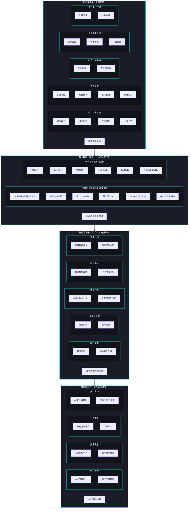

# 视评智能AI测评系统 - 架构图 (Mermaid版本)

## 系统整体技术架构

---

## 横向流程图版本

```mermaid
flowchart LR
    %% 样式
    classDef layerBox fill:#1a1d27,stroke:#24C8C8,stroke-width:2px,color:#fff;
    classDef box fill:#12141C,stroke:#24C8C833,stroke-width:1px,color:#fff;
    classDef title fill:#24C8C8,stroke:#24C8C8,stroke-width:1px,color:#12141C,font-weight:bold;
    
    subgraph Data[数据采集层]
        direction TB
        D1[视觉动态数据]
        D2[语音数据]
        D3[文本交互数据]
        D4[场景环境数据]
        D5[任务执行数据]
    end

    subgraph Engine[核心技术引擎层]
        direction TB
        E1[高精度计算机视觉动捕引擎]
        E2[多模态智能识别引擎]
    end

    subgraph Service[智能测评服务层]
        direction TB
        S1[测评场景]
        S2[自动化调度]
        S3[数据分析]
        S4[智能评分]
        S5[模型迭代]
    end

    subgraph Output[应用输出层]
        direction TB
        O1[Web管理]
        O2[数据展示]
        O3[报告输出]
        O4[接口定制]
    end

    Data --> Engine
    Engine --> Service
    Service --> Output
    
    class Data,Engine,Service,Output layerBox
    class D1,D2,D3,D4,D5,E1,E2,S1,S2,S3,S4,S5,O1,O2,O3,O4 box
```

---

## 使用说明

将上述Mermaid代码可以在以下平台使用：

1. **GitHub / GitLab - 直接在Markdown文件中使用
2. **Mermaid Live Editor** - https://mermaid.live/
3. **VS Code** - 安装Mermaid插件
4. **Notion** - 支持Mermaid图表

---

*文档生成日期: 2026-06-04*
